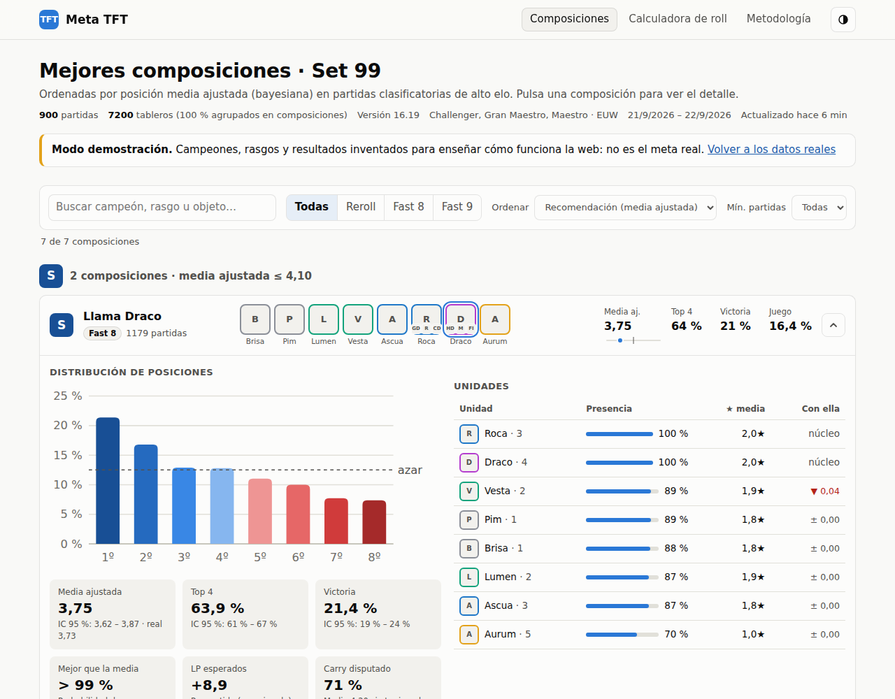
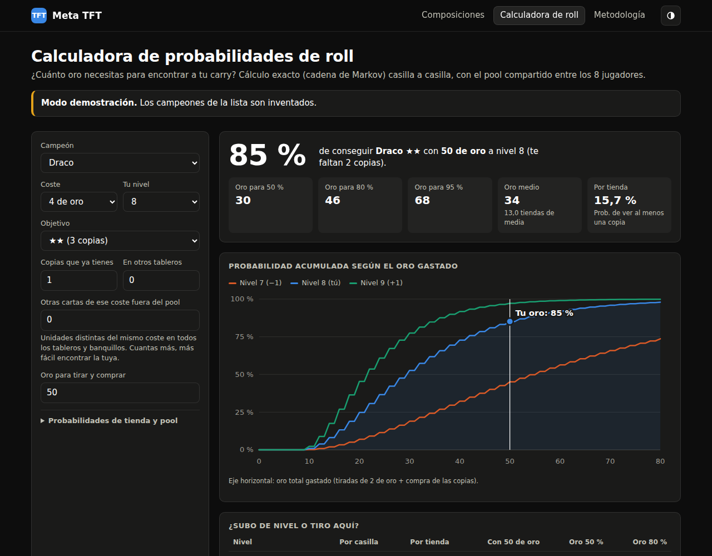

# Meta TFT

Web personal que te dice **cuáles son las mejores composiciones del meta actual de Teamfight Tactics**
a partir de partidas reales de alto elo, con estadística bayesiana y una calculadora de probabilidades de roll.

- **Composiciones detectadas automáticamente** a partir de los tableros finales (nada de listas a mano).
- **Tier list por posición media ajustada**: la media se corrige por tamaño de muestra para que una comp
  con 12 partidas afortunadas no aparezca como S.
- Para cada composición: distribución de posiciones, Top 4 y victorias con **intervalos de confianza**,
  **probabilidad de ser mejor que la media**, LP esperados, unidades y su impacto, builds de objetos del carry
  y del tanque, rasgos, nivel final y **cuánto empeora si otro jugador te disputa el carry**.
- **Calculadora de roll**: probabilidad exacta (cadena de Markov) de conseguir tu carry a 2★/3★ según el oro,
  el nivel y las copias que hay fuera del pool, comparando con subir o bajar un nivel.
- Modo claro/oscuro, adaptada a móvil, sin dependencias ni paso de compilación.

| Composiciones | Calculadora |
|---|---|
|  |  |

*(Capturas con los datos de demostración, que son inventados.)*

## Cómo funciona

```
GitHub Action (cada 6 h)
  └─ scripts/update_meta.py
       ├─ API oficial de Riot: mejores jugadores (Challenger/GM/Master) → sus partidas clasificatorias
       ├─ CommunityDragon: nombres, costes, rasgos e iconos del set actual
       ├─ agrupa los tableros en composiciones y agrega estadísticas
       └─ escribe data/meta.json  ──►  index.html (web estática) lo lee y calcula las métricas
```

- Solo se usan partidas **clasificatorias del set actual y del parche más reciente** (si hay poca muestra
  justo después de un parche, se añade el anterior y la web lo indica).
- Las partidas descargadas se guardan en la caché de GitHub Actions (7 días), así que cada ejecución
  solo pide las nuevas y la muestra va creciendo.
- En `data/meta.json` no se guarda ningún identificador de jugador.
- Toda la explicación matemática está en la pestaña **Metodología** de la web.

## Puesta en marcha

1. **Lleva estos cambios a `main`** (el Action programado solo corre desde la rama por defecto).
2. **Consigue una clave de la API de Riot** en <https://developer.riotgames.com>.
   - La *Development API Key* sirve para probar, pero **caduca cada 24 h**.
   - Para que se actualice sola, registra un producto y pide una **Personal API Key** (no caduca).
3. En GitHub: **Settings → Secrets and variables → Actions → New repository secret**
   con nombre `RIOT_API_KEY` y la clave como valor.
4. En **Actions → “Actualizar meta TFT” → Run workflow**. La primera ejecución tarda unos 10-15 minutos
   y guarda `data/meta.json` en el repositorio. A partir de ahí se repite cada 6 horas.

### Ver la web

- **En local** (siempre funciona):
  ```bash
  git pull
  python3 -m http.server 8000
  # abre http://localhost:8000
  ```
  Sin `data/meta.json` verás instrucciones y un botón para la demo (`http://localhost:8000/?demo`).
- **En GitHub Pages**: *Settings → Pages → Source: GitHub Actions* y crea la variable de repositorio
  `DEPLOY_PAGES` con valor `true` (*Settings → Secrets and variables → Actions → Variables*).
  El mismo Action publicará la web tras cada actualización. Ojo: este repositorio es privado, y GitHub Pages
  en repositorios privados requiere un plan de pago (GitHub Pro o superior); en un repo público es gratis.

## Configuración

Variables de repositorio opcionales (*Settings → Secrets and variables → Actions → Variables*):

| Variable | Por defecto | Qué hace |
|---|---|---|
| `TFT_PLATFORMS` | `euw1,kr,na1` | Servidores de los que se descargan partidas (`euw1`, `eun1`, `na1`, `kr`, `br1`, `la1`, `la2`, `jp1`, `oc1`, `tr1`, `ru`, `sg2`, `tw2`, `vn2`…). |
| `TFT_TIERS` | `challenger,grandmaster,master` | Ligas de las que se toman jugadores. |
| `TFT_PLAYERS_PER_PLATFORM` | `120` | Mejores jugadores por servidor. |
| `TFT_MAX_NEW_MATCHES` | `400` | Partidas nuevas por servidor y ejecución (con clave personal, ~1,3 s por partida). |
| `TFT_LANG` | `es_es` | Idioma de nombres de campeones, rasgos y objetos (`en_us`, `es_mx`…). |
| `DEPLOY_PAGES` | — | `true` para publicar en GitHub Pages. |

`data/game-config.json` contiene las probabilidades de tienda por nivel, el tamaño del pool, la tabla de LP
aproximada y los umbrales de cada tier. **Revisa las probabilidades de tienda si un parche las cambia**
(la calculadora también permite editarlas al momento).

## Desarrollo

```bash
python3 -m unittest discover -s tests -v   # pipeline: análisis + API de Riot simulada
node --test tests/*.test.mjs               # estadística y probabilidades (incluye Monte Carlo)

# Regenerar la demo con datos sintéticos
python3 tests/fixtures/synth.py /tmp/synth 900
python3 scripts/update_meta.py --matches-dir /tmp/synth/matches --static /tmp/synth/cdragon.json \
  --no-fetch --cache /tmp/synth/cache.json.gz --out data/demo/meta.json --source demo
```

| Ruta | Contenido |
|---|---|
| `index.html`, `assets/` | Web estática (HTML, CSS y JavaScript sin dependencias). |
| `assets/js/stats.js` | Estadística: medias bayesianas, Wilson, Dirichlet, cadena de Markov de la tienda. |
| `scripts/update_meta.py` | Orquestador: descarga, caché, análisis y escritura de `data/meta.json`. |
| `scripts/tft/riot.py` | Cliente de la API de Riot con control de *rate limit* y reintentos. |
| `scripts/tft/analyze.py` | Detección de composiciones (semillas + *k-modes*) y agregación. |
| `scripts/tft/static.py` | Datos del set desde CommunityDragon. |
| `.github/workflows/` | Actualización programada + despliegue, y tests. |

---

Meta TFT no está respaldado por Riot Games y no refleja las opiniones de Riot Games ni de nadie oficialmente
involucrado en la producción o gestión de las propiedades de Riot Games. Riot Games y todas las propiedades
asociadas son marcas comerciales o registradas de Riot Games, Inc.
